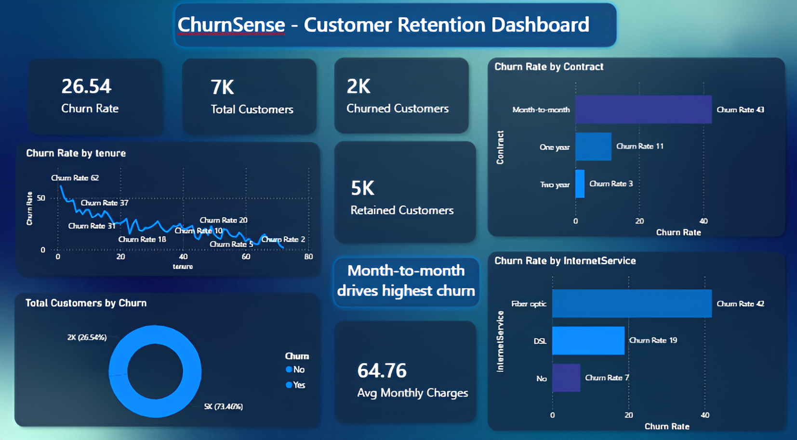

# 📊ChurnSense - Customer Retention Analysis & Prediction

**An end-to-end data analytics and machine learning project uncovering why customers leave and how to prevent it.**

<p align="center">
  
  
  
  
</p>

<p align="center">
📉Transforming churn data into actionable retention strategies📈
</p>

---

## 🌟About the Project

Customer churn is one of the most critical challenges in subscription-based businesses.

In this project, a telecom dataset of **7,043 customers** is analyzed to understand why **26.5% of customers left** and how businesses can proactively reduce churn.

Beyond analysis, this project builds a **predictive machine learning model** and translates findings into **real-world business strategies**.

> ⚠️Note:
> This project focuses not just on prediction, but on **data-driven decision making**.

---

## 🎯Problem Statement

A telecom company is silently losing customers every month.
While churn is measurable, the **underlying causes remain unclear**.

This project aims to:

✤ Identify **key drivers of customer churn** <br>
✤ Detect **high-risk customer segments** <br>
✤ Build a **predictive model** for early churn detection <br>
✤ Provide **actionable business recommendations** <br>

---

## 📊Dataset

✤ **Source:** Kaggle — Telco Customer Churn <br>
✤ **Size:** 7,043 customers, 21 features <br>
✤ **Churn Rate:** 26.5% (1,869 customers) <br>

---

## 🚀Features

✤ **Exploratory Data Analysis (EDA)** – Pattern discovery and trend analysis<br>
✤ **SQL Integration** – Structured querying using SQLite<br>
✤ **Customer Segmentation** – Behavioral analysis of churn patterns<br>
✤ **Machine Learning Model** – Predicts churn with **82.19% accuracy**<br>
✤ **Feature Importance Analysis** – Identifying key churn drivers<br>
✤ **Power BI Dashboard** – Interactive visualization layer <br>
✤ **End-to-End Workflow** – From raw data → insights → prediction → strategy

---

## 🧠Project Architecture

This project follows a structured analytics pipeline:

**Data Layer**<br>
(Telecom Dataset + SQL Processing)<br>
↓<br>
**Data Cleaning & Preprocessing**
(Pandas, Feature Engineering) <br>
↓<br>
**Exploratory Data Analysis** <br>
(Visualization & Pattern Discovery) <br>
↓<br>
**Machine Learning Models**<br>
(Logistic Regression, Random Forest)<br>
↓<br>
**Business Insights Layer**<br>
(Actionable Recommendations & Dashboard)<br>

**Key Design Principles**:<br>
✤ Reproducible workflow<br>
✤ Separation of analysis and modeling<br>
✤ Business-oriented interpretation<br>
✤ Data-driven decision making<br>

---

## 🛠Tech Stack

| Category           | Technology          |
| ------------------ | ------------------- |
| 💻Language         | Python              |
| 🗄Database          | SQLite + SQL        |
| 📊Analysis         | Pandas, NumPy       |
| 📈Visualization    | Matplotlib, Seaborn |
| 🤖Machine Learning | Scikit-learn        |
| 📊BI Tool          | Power BI            |
| 🧪Environment      | Jupyter Notebook    |

---

## 📁Project Structure

```
customer-retention-analysis/
│
├── 01_Data_Setup.ipynb        #Data loading, SQL queries, SQLite setup
├── 02_EDA.ipynb               #Exploratory analysis & visualizations
├── 03_Churn_Analysis.ipynb    #Cohort analysis & root cause insights
├── 04_Prediction_Model.ipynb  #ML models (Logistic Regression, Random Forest)
├── churn_clean.csv            #Clean dataset for Power BI dashboard
├── ChurnSense_Dashboard.pbix  #Interactive Power BI dashboard
├── ChurnSense_Dashboard.png   #Dashboard preview screenshot
├── ChurnSense_Playbook.pptx   #Business presentation & recommendations
└── README.md
```

---

## 📊Key Insights

The analysis revealed clear churn patterns:

✤ **Month-to-Month Contracts** → Highest churn due to low commitment<br>
✤ **New Customers (0–12 months)** → Most vulnerable segment<br>
✤ **Fiber Optic Users** → Higher churn (possible pricing/service issues)<br>
✤ **High-Paying Customers** → Surprisingly more likely to churn<br>
✤ **Lack of Support Services** → No OnlineSecurity/TechSupport increases churn

These insights directly guide retention strategies.

---
## 📸Dashboard Preview



> 🔵Built with Power BI · Dark theme · Interactive filters by Contract & Internet Service <br>

---

## 🤖Machine Learning Results

| Model               | Performance                 |
| ------------------- | --------------------------- |
| Logistic Regression | **82.19% Accuracy**         |
| Random Forest       | Feature importance analysis |

**Top Churn Predictors:**

1. TotalCharges
2. Tenure
3. MonthlyCharges

This enables businesses to **identify at-risk customers before they leave**.

---

## 📌Churn Playbook — Business Recommendations

**1. Incentivize Long-Term Contracts**
Encourage customers to shift from month-to-month plans using discounts or benefits.

**2. Strengthen First-Year Retention**
Introduce onboarding programs, engagement campaigns, or early support systems.

**3. Investigate Fiber Optic Services**
Analyze pricing and service quality to address high churn in this segment.

**4. Promote Value-Added Services**
Encourage adoption of OnlineSecurity and TechSupport to improve retention.

👉 These strategies convert data insights into **measurable business impact**

---

## ▶️How to Run the Project

### 1️⃣Clone the Repository

```bash
git clone https://github.com/saxena-693/customer-retention-analysis.git
cd customer-retention-analysis
```

### 2️⃣Install Dependencies

```bash
pip install pandas matplotlib seaborn scikit-learn jupyterlab
```

### 3️⃣Download Dataset

Download from Kaggle and place it as:
`Telco-Customer-Churn.csv`

### 4️⃣Run Notebooks

Execute in order:

```
01 → 02 → 03 → 04
```

---

## 📚Key Learnings

✤ Understanding customer behavior through data <br>
✤ Applying SQL in analytics workflows<br>
✤ Building and evaluating classification models<br>
✤ Feature importance interpretation<br>
✤ Translating analysis into business strategy<br>

---
## 🔮Future Improvements

✤ Deploy model as API <br>
✤ Real-time dashboard integration <br>
✤ Automated churn alerts <br>

---

## 👩‍💻Author

**Nandini Saxena** <br>
🎓 B.Tech (Computer Science & Engineering) <br>
💡 Interested in Data Analytics, Machine Learning & Business Intelligence <br>

<p align="center">
  <a href="https://www.linkedin.com/in/nandini-saxena-codes" target="_blank">
    
  </a>
  
  <a href="https://nandinisaxena.netlify.app/" target="_blank">
    
  </a>
</p>

<p align="center">✨If you found this project insightful, consider giving it a star✨</p>

---

